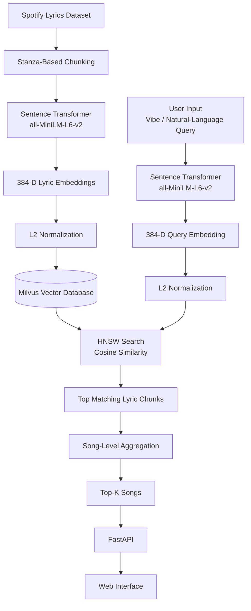

# 🎵 Vibe Search — Spotify Semantic Search Engine

A semantic search engine for the **Spotify Million Song Dataset** that allows users to discover songs based on the **meaning, mood, or vibe of their lyrics**, rather than relying only on exact song titles, artists, or keywords.

For example, a user can search:

> `melancholic acoustic song for a rainy morning`

and the system retrieves songs whose lyrics are semantically similar to that description.

The project uses **Sentence Transformers**, **cosine similarity**, **HNSW**, **Milvus**, and **FastAPI** to provide fast semantic retrieval across approximately **57,650 songs**.

---

## ✨ Features

- 🔎 Semantic search based on lyrical meaning and mood
- 🎵 Approximately 57,650 songs
- 🧠 Sentence Transformer embeddings using `all-MiniLM-L6-v2`
- 📐 384-dimensional embedding vectors
- 📝 Stanza-based lyric chunking
- 📏 Cosine similarity for semantic matching
- ⚡ HNSW approximate nearest-neighbor search
- 🗄️ Milvus vector database
- 🌐 FastAPI backend
- 🎨 Custom web interface
- 📊 Recall@K and latency evaluation
- 💾 Checkpoint support for long indexing processes

---

## 🏗️ System Architecture

## 🏗️ System Architecture



When a user submits a query, the query is converted into an embedding using the **same MiniLM model**. The query vector is then compared against the indexed lyric embeddings to retrieve the most semantically similar songs.

---

## 📁 Project Structure

```text
spotify-semantic-search/
│
├── app.py
├── build_index.py
├── evaluate.py
├── search_engine.py
├── requirements.txt
├── README.md
├── .gitignore
│
├── data/
│   └── spotify_millsongdata.csv
│
├── static/
│   ├── script.js
│   └── style.css
│
└── templates/
    └── index.html
```

### Main Files

| File | Description |
|---|---|
| `build_index.py` | Processes the dataset, chunks lyrics, generates embeddings, and builds the vector index |
| `search_engine.py` | Contains the core semantic search, embedding, Milvus, and retrieval logic |
| `evaluate.py` | Evaluates HNSW retrieval against exact cosine search using Recall@K and latency |
| `app.py` | FastAPI application that connects the search engine to the web interface |
| `templates/index.html` | Main web interface |
| `static/style.css` | Web interface styling |
| `static/script.js` | Frontend search functionality |
| `requirements.txt` | Python dependencies |

---

## 📊 Dataset

This project uses the **Spotify Million Song Dataset**, available on Kaggle.

🔗 [Spotify Million Song Dataset — Kaggle](https://www.kaggle.com/datasets/notshrirang/spotify-million-song-dataset)

The dataset contains approximately **57,650 songs** with information including:

- Artist
- Song title
- Lyrics

The lyrics are the primary signal used by the semantic search engine.

### Why is the dataset not included?

The dataset is not stored directly in this GitHub repository because of its size and distribution/licensing considerations.

To run the project, download it separately from Kaggle.

---

## 🚀 Getting Started

### 1. Clone the Repository

```bash
git clone <your-repository-url>
cd <your-repository-folder>
```

---

### 2. Create a Virtual Environment

#### Windows

```bash
python -m venv .venv
.venv\Scripts\activate
```

#### macOS / Linux

```bash
python3 -m venv .venv
source .venv/bin/activate
```

---

### 3. Install Dependencies

```bash
pip install -r requirements.txt
```

---

### 4. Download the Dataset

Download the dataset from Kaggle:

[Spotify Million Song Dataset](https://www.kaggle.com/datasets/mrdatapsycho/spotify-million-song-dataset)

Extract the downloaded file and place:

```text
spotify_millsongdata.csv
```

inside the `data/` directory:

```text
spotify-semantic-search/
│
├── data/
│   └── spotify_millsongdata.csv
│
├── app.py
├── build_index.py
├── evaluate.py
├── search_engine.py
└── requirements.txt
```

---

## 🧪 Quick Test

Before processing the complete dataset, you can test the pipeline on a smaller sample:

```bash
python build_index.py data/spotify_millsongdata.csv --sample 2000
```

This is useful for checking that the environment, embedding model, and vector database are working correctly.

---

## 🔨 Build the Full Index

Once the test works correctly, build the index using the complete dataset:

```bash
python build_index.py data/spotify_millsongdata.csv
```

The script will:

1. Load the Spotify dataset
2. Process each song's lyrics
3. Split the lyrics into stanza-based chunks
4. Generate embeddings using `all-MiniLM-L6-v2`
5. Normalize the embeddings
6. Store the vectors and metadata
7. Build the HNSW search index
8. Save the resulting search data locally

> Processing the full dataset can take time, especially when running the embedding model on CPU.

---

## ▶️ Run the Application

After the index has been successfully built, start the FastAPI application:

```bash
uvicorn app:app --reload
```

Then open:

```text
http://127.0.0.1:8000
```

in your browser.

You can now enter descriptions such as:

```text
peaceful sunset by the sea
```

```text
late night drive through the city
```

```text
rainy morning feeling
```

The system will return songs whose lyrics are semantically related to the query.

---

## 🧠 Embedding Model

The project uses:

```text
sentence-transformers/all-MiniLM-L6-v2
```

MiniLM converts each lyric chunk and search query into a:

```text
384-dimensional vector
```

These vectors represent semantic meaning.

This means that two pieces of text can be considered similar even when they do not contain exactly the same words.

For example:

```text
Query:
"peaceful evening by the ocean"

Lyric:
"watching the sun disappear across the sea"
```

They may have relatively few words in common, but their embeddings can still be close because they express related semantic concepts.

### Why MiniLM?

`all-MiniLM-L6-v2` was selected because it provides a practical balance between:

- Semantic representation quality
- Embedding speed
- Memory usage
- CPU feasibility
- Model complexity

This is particularly useful when embedding hundreds of thousands of lyric chunks.

---

## 📝 Stanza-Based Chunking

Instead of generating one embedding for an entire song, the lyrics are divided into smaller **stanza-based chunks**.

Conceptually:

```text
Full Lyrics
    │
    ├── Verse 1
    ├── Chorus
    ├── Verse 2
    └── Chorus
```

Each meaningful chunk receives its own embedding.

### Why not embed the entire song?

A song can contain several different ideas or emotions.

Representing the entire lyric as one vector may average those meanings together and make specific semantic matches harder to retrieve.

Stanza-level chunking allows the search engine to match the user's query against more focused sections of lyrics.

The implementation also includes fallback handling for unusually long or very short chunks.

---

## 📐 Cosine Similarity

The search engine uses **cosine similarity** to compare the user's query embedding with lyric embeddings.

Cosine similarity measures the similarity in the **direction** of two vectors.

Conceptually:

```text
cosine_similarity(query_vector, lyric_vector)
```

A higher cosine similarity indicates that the query and lyric chunk are more semantically related.

The embeddings are normalized before comparison, making cosine similarity appropriate for this semantic retrieval task.

---

## ⚡ HNSW Search

The project uses **HNSW (Hierarchical Navigable Small World)** for approximate nearest-neighbor search.

Searching every stored vector individually becomes increasingly expensive as the number of embeddings grows.

HNSW instead organizes vectors into a graph structure that allows the system to quickly navigate toward vectors that are likely to be similar to the query.

```text
Query Vector
     │
     ▼
HNSW Graph
     │
     ▼
Nearest Lyric Embeddings
     │
     ▼
Top-K Results
```

HNSW provides a trade-off between:

- Search speed
- Retrieval accuracy

It is an **approximate** nearest-neighbor method, meaning it is designed to find results very close to those returned by exact search while requiring less search work.

---

## 🗄️ Milvus

**Milvus** is used as the vector database for storing and searching the lyric embeddings.

Each indexed lyric chunk contains information such as:

```text
Embedding
Song
Artist
Lyric Chunk
```

Milvus performs the vector similarity search using the HNSW index.

The general retrieval process is:

```text
User Query
    ↓
MiniLM
    ↓
Query Embedding
    ↓
Milvus
    ↓
HNSW Search
    ↓
Cosine Similarity
    ↓
Top Matching Chunks
    ↓
Song Aggregation
    ↓
Search Results
```

---

## 🎵 Song-Level Aggregation

The vector database searches **lyric chunks**, but users want **songs** as their final results.

A song may contain several indexed chunks.

After retrieval, the system groups matching chunks by song and keeps the strongest matching chunk for each song.

For example:

```text
Song A
 ├── Verse 1 → 0.61
 ├── Chorus  → 0.82  ← Best match
 └── Verse 2 → 0.70

Final Song A Score → 0.82
```

This prevents a song with many similar chunks from unnecessarily occupying several positions in the final result list.

---

## 📊 Evaluation

The project includes:

```text
evaluate.py
```

to evaluate the quality and speed of the HNSW search.

Run:

```bash
python evaluate.py
```

The evaluation compares:

```text
HNSW Search
     VS
Exact Cosine Search
```

### Recall@K

Recall@K measures how many of the exact search's Top-K results are also retrieved by HNSW.

For one query:

```text
Recall@K =
Number of matching Top-K results
────────────────────────────────
               K
```

For example, if:

```text
K = 10
```

and HNSW retrieves 9 of the same results found by exact search:

```text
Recall@10 = 9 / 10 = 0.90
```

The final reported recall is averaged across the evaluation queries.

A result such as:

```text
Recall@10 = 0.99
```

means that, on average, HNSW retrieved approximately **99% of the Top-10 neighbors returned by exact search** for the evaluated queries.

---

## ⏱️ Latency Evaluation

The evaluation also measures the time required by:

- HNSW search
- Exact brute-force search

This demonstrates the trade-off between retrieval speed and recall.

Exact search acts as the reference because it compares the query against the complete vector set.

HNSW attempts to retrieve nearly the same neighbors while avoiding a full scan.

---

## 💾 Checkpointing

Building embeddings for the complete dataset can take a long time.

To reduce the risk of losing progress if the process is interrupted, the project includes a checkpoint mechanism.

Progress is periodically stored under:

```text
data/checkpoints/
```

For example:

```text
data/checkpoints/
├── embeddings.dat
└── progress.txt
```

The checkpoint stores the embedding progress so that an interrupted indexing process can continue rather than restarting the entire embedding stage from the beginning.

---

## 🌐 FastAPI

FastAPI provides the backend that connects the semantic search engine with the browser interface.

The responsibilities are separated:

```text
Frontend
   │
   ▼
FastAPI
   │
   ▼
SemanticSearchEngine
   │
   ▼
MiniLM + Milvus + HNSW
```

`app.py` handles the web/API layer, while `search_engine.py` contains the semantic search logic.

The development server can be started using:

```bash
uvicorn app:app --reload
```

The `--reload` option automatically restarts the development server when Python source files are changed.

---

## 🔄 Complete Search Flow

When a user performs a search:

```text
1. User enters a natural-language query
               ↓
2. FastAPI receives the query
               ↓
3. MiniLM converts the query into a 384-D embedding
               ↓
4. The embedding is normalized
               ↓
5. Milvus receives the query vector
               ↓
6. HNSW searches for nearby lyric embeddings
               ↓
7. Cosine similarity determines semantic closeness
               ↓
8. Matching lyric chunks are retrieved
               ↓
9. Results are aggregated by song
               ↓
10. Top-K songs are returned
               ↓
11. FastAPI sends the results to the frontend
               ↓
12. Results are displayed in the browser
```

---

## 🛠️ Technologies Used

| Technology | Purpose |
|---|---|
| Python | Main programming language |
| Sentence Transformers | Generate semantic embeddings |
| `all-MiniLM-L6-v2` | Text embedding model |
| Milvus | Vector database |
| HNSW | Approximate nearest-neighbor search |
| Cosine Similarity | Semantic similarity measurement |
| FastAPI | Backend/API |
| Uvicorn | ASGI server |
| HTML | Web interface structure |
| CSS | Web interface styling |
| JavaScript | Frontend interaction |
| NumPy | Vector/evaluation operations |
| Pandas | Dataset processing |

---

## ⚠️ Limitations

The current implementation has several limitations:

- Search relies only on lyrics and does not use audio features.
- Search quality depends on the semantic representation produced by MiniLM.
- Stanza splitting depends partly on the formatting of the original lyrics.
- Repeated choruses may create similar or duplicate embeddings.
- HNSW is approximate and therefore does not guarantee exactly the same Top-K results as exhaustive search.
- The evaluation uses a limited set of predefined semantic queries.
- No reranking model is currently applied after the initial retrieval.
- The application runs locally by default and is not automatically publicly accessible over the internet.

---

## 🔮 Possible Future Improvements

Possible extensions include:

- 🎧 Add audio embeddings or Spotify audio features
- 🎼 Combine lyric and audio similarity
- 🤖 Add a reranking model
- 🔍 Expand the evaluation query set
- 📊 Compare HNSW with IVF and other indexing strategies
- ☁️ Deploy the application online
- 🎤 Add filters for artist, genre, or year
- ❤️ Add personalized song recommendations
- 🧠 Experiment with larger embedding models
- 🔄 Detect and remove duplicate chorus chunks

---

## 📌 Important Note

The dataset and generated vector/index files are intentionally excluded from the GitHub repository.

After cloning the project, users should:

```text
1. Download the dataset from Kaggle
2. Place spotify_millsongdata.csv inside data/
3. Install requirements
4. Run build_index.py
5. Start the FastAPI application
```

Generated files can then be recreated locally from the source dataset.

---

## 👨‍💻 Author

**Vinchhieng Khlim**

Deep Learning Project — Spotify Semantic Search Engine

---

## 🙏 Acknowledgements

This project was developed for educational purposes using the following open-source tools and resources:

- [Spotify Million Song Dataset — Kaggle](https://www.kaggle.com/datasets/mrdatapsycho/spotify-million-song-dataset) — lyrics dataset used for building the search engine
- [Sentence Transformers](https://www.sbert.net/) — provides the `all-MiniLM-L6-v2` model used to generate semantic embeddings
- [Milvus](https://milvus.io/) — vector database and HNSW-based similarity search
- [FastAPI](https://fastapi.tiangolo.com/) — web API framework used for the backend
- [Uvicorn](https://www.uvicorn.org/) — ASGI server used to run the FastAPI application

Special thanks to the open-source community and the creators of these resources for making this project possible.

---

⭐ If you find this project useful, feel free to explore the repository and experiment with your own semantic search queries.
